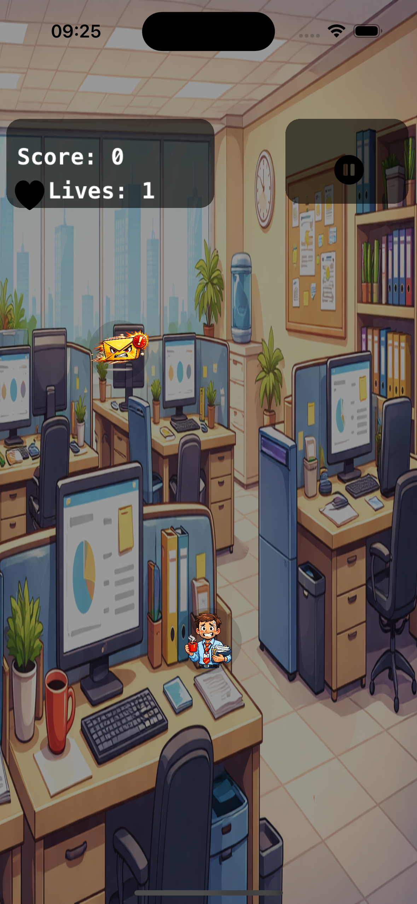

# OfficeDodge

OfficeDodge is a small iOS endless dodger game built with SwiftUI + SpriteKit.

## Scope
- Deliver a playable and demo-friendly game loop.
- Keep gameplay deterministic with seeded randomness for reproducible verification.
- Maintain modular architecture to support realistic refactor/bug-fix benchmarks.

## Objective
- Compare coding assistants in realistic engineering workflows.
- Use one shared codebase with deterministic tests, QA evidence, and repeatable tasks.

## Game Description
You play an overloaded office worker. Move left and right to dodge incoming office chaos (emails, meetings, bugs, managers, tickets), keep your lives, and survive as long as possible.

## Screenshot

## How To Play
1. Open the app and tap `Start`.
2. Drag left/right to move the player at the bottom.
3. Avoid falling obstacles.
4. Use `PAUSE` any time to freeze/resume gameplay.
5. If lives reach zero, the `Game Over` screen appears.
6. Tap `Restart` to retry or `Main Menu` to return.

## HUD
- `Score`: run score.
- `Lives`: remaining lives.
- `PAUSE`: toggles pause/resume.

## Development
- Build: `make build`
- Test: `make test`
- Run on simulator: `make run`
- Agent template check: `ai-scripts/validate-template`
